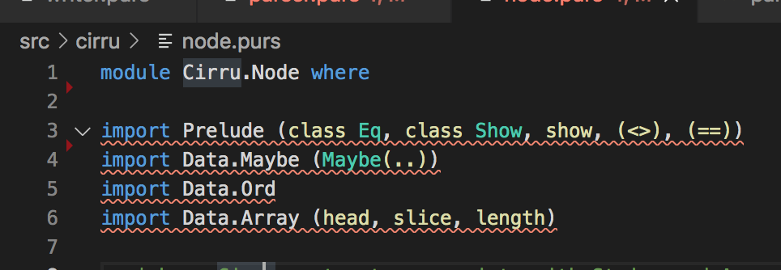

  

## Color Coding and Automatic Filling
I hadn't thought much about the color-coded nature of coding until we started working without it. When first coding in Java, I remember a myriad of errors manifesting as various underlines of yellows and reds reminiscent of an all-nighter English paper. While an English professor is generous enough to include hints for your corrections, modern coding software is even more so generous by including direct substitutes for your code to fix whatever blunder you'd made. Only then did I learn to appreciate the hotkeys that allow you to finish a line of code automatically via the suggestions made by the coding software.

## Thoughts on Color Coding
Being without such magic in our first weeks of ICS 314 would've been a terror had our projects on JSFiddle been comically large. Luckily, a lot of it was dedicated to grasping and accelerating our knowledge of the basics. As of now, we're again using an IDE for our code, being IntelliJ. An "IDE", being "Integrated Development Environment" software built to assist in coding efficiency, with some of the features aformentioned in the previous paragraph being mainstays. To me, coding with color-coded guidelines and error indicators are a much-needed feature with the careless mistakes I can make on occasion. Our current IDE even displays a green checkmark to relay that our code is without flaw. Though, even so, an incorrect program that operates correctly is still incorrect.
