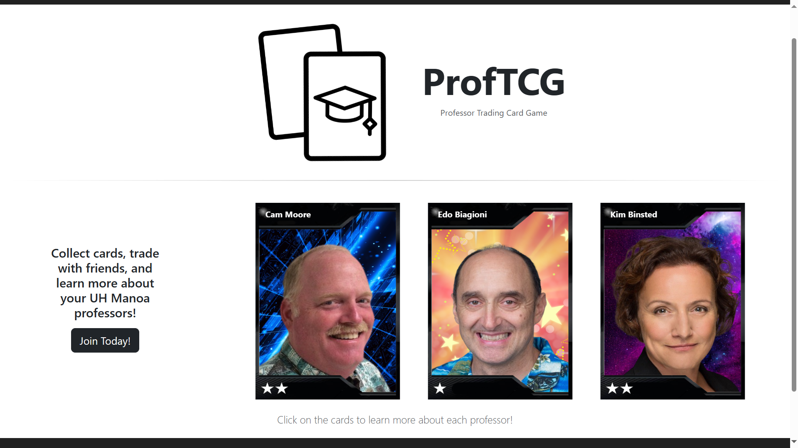

  

## ProfTCG, UH Manoa's Professor-based Trading Card Game
It's not actually a game, it's more a Trading Card simulator. You collect cards of UH Manoa's Professors, read a tidbit about them via clicking on their card, and trade said card with other users to get more cards. All users get a free random card through the click of a button in a Card Packs page that then goes on a 24 hour cooldown before it's available for use again. The goal was to promote interactivity between students and Professors by providing a slight "ice breaker" of said Professor which could lead into a starting point for conversation or, at the very least, establish them a bit as a person and instill familiarity.

## Card Mechanics and Functions
As a behind the scenes, each card has a variable for the associated Professor's name, rarity, their description text, profile shot, and so on. Trading a card between users simply swaps the owner variable of the card, and upon admin changes for a card's field variable, all copies of said card are immediately affected, meaning the existence of rare misprints on a Professor Card are sadly a near-impossibility.

## What did I do? What did I learn?
I was responsible for making Cards. Card Images, the development of the Card Packs and user collection page (Your Cards). Most of it got scrapped or repurposed. I should've communicated and spoke up more with the group. There were concerns I had that I didn't voice until it was too late that resulted in a process more hectic than necessary. While the end result is functional, I could've done a lot more for the project visually or content-wise, and that feeling of there being a missed opportunity weighs me down a bit. However, what's done is done, all that's left is what lies ahead of me.

And another note, for those interested in the site, see [here](https://github.com/ProfTCG/proftcg.github.io).
