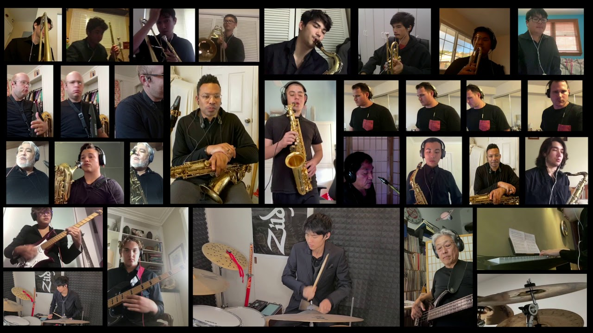

  

While in high school, I was a part of Maryknoll's intermediate band. First playing the trumpet for a year, then picking up the tenor sax for the next three. Despite this, my sound was pretty mediocre. I could never achieve that rich, bustling sound that the saxophone was known for. Still, the concerts we performed were events that I looked forward to. There was something special about playing as an entire ensemble, and having ample opportunity to sneak in cheeky fills to hype either ourselves or our bandmates up mid-performance. Though I'm well-aware of UH's music department, I haven't had the drive to join a band in some time. Perhaps someday that'll change.

To me, the band was one of the most primal displays of teamwork I've ever witnessed. On-stage it was coordination nigh unspoken! Off-stage, we all had our own practice to do. My one takeaway from high school band is that practice alone isn't enough. What we need is good practice. Exciting practice. Fun practice. Exhausting practice. Sadly, our last year of high school was made virtual due to COVID-19. Luckily, we secured one last performance, a tribute with spotlights on our best students and instructors. If this is of any interest to you, then [enjoy](https://youtu.be/_vMoJZXTg68).
